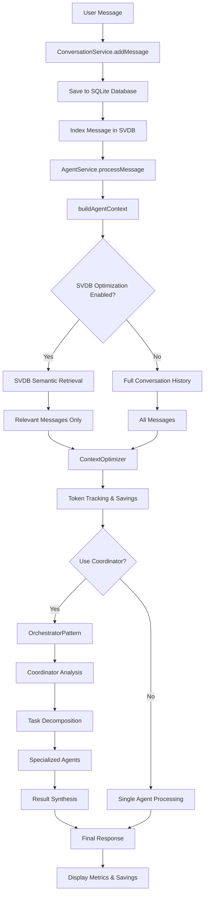
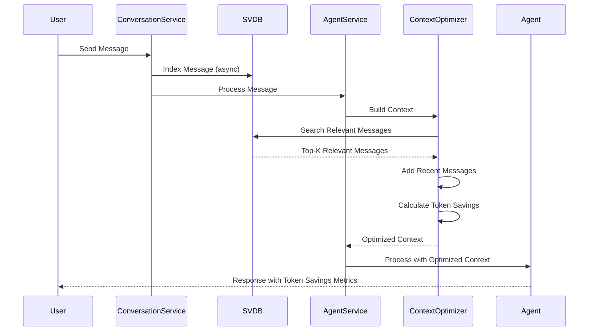
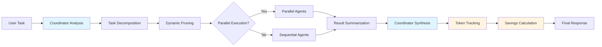

# Foundation Chat

Intelligent chat system using Apple's FoundationModels with coordinator-based orchestration and SVDB-powered token optimization.

## Overview

Foundation Chat is a Swift-based agent system that uses a **coordinator pattern** to orchestrate specialized agents. The coordinator analyzes tasks, decomposes them into subtasks, delegates to specialized agents, and synthesizes results. The system features **SVDB (Semantic Vector Database) integration** for intelligent context optimization, achieving 50-80% token savings on long conversations by retrieving only semantically relevant messages instead of sending full conversation history.

## Architecture

The system supports two modes with intelligent context optimization powered by SVDB semantic retrieval.

### System Architecture Flow



### Single-Agent Mode (Recommended)
```
User Message
    ↓
ConversationService.addMessage() → Index in SVDB
    ↓
AgentService.processSingleAgentMessage()
    ↓
SVDB Semantic Retrieval (relevant messages only)
    ↓
Selected Agent (direct processing)
    ├── WebSearchAgent
    ├── FileReaderAgent
    ├── CodeAnalysisAgent
    └── DataAnalysisAgent
    ↓
Final Response (with token savings tracking)
```

### Orchestrator Mode (Experimental)
```
User Message
    ↓
ConversationService.addMessage() → Index in SVDB
    ↓
AgentService.processMessage()
    ↓
SVDB Semantic Retrieval (relevant messages only)
    ↓
AgentOrchestrator (OrchestratorPattern)
    ↓
Coordinator Agent (analyzes & decomposes)
    ↓
Specialized Agents (execute subtasks)
    ├── FileReaderAgent
    ├── WebSearchAgent
    ├── CodeAnalysisAgent
    └── DataAnalysisAgent
    ↓
Coordinator (synthesizes results)
    ↓
Final Response (with token savings tracking)
```

### SVDB Token Optimization

The system uses **SVDB (Semantic Vector Database)** to dramatically reduce token usage:



**How it works:**
1. **Message Indexing**: All conversation messages are automatically indexed in SVDB when saved
2. **Semantic Retrieval**: When building context, the system uses the current user message as a query to retrieve only relevant messages
3. **Recent Messages**: Last N messages (default: 3) are always included for context continuity
4. **Token Savings**: Only relevant messages are sent to the LLM instead of full conversation history

**Results**: 50-80% reduction in context tokens for long conversations, with real-time token savings tracking displayed in the UI.

## Quick Start

### Requirements

- macOS 26.0+ or iOS 26.0+
- Apple Intelligence enabled
- Swift 6.2+

### Build

```bash
swift build
```

### Run CLI

```bash
# Interactive chat
swift run foundation-chat chat

# Single message
swift run foundation-chat chat -m "Analyze this codebase"
```

## Key Components

### SVDB Integration

**RAGService** (`Sources/FoundationChatCore/Services/RAGService.swift`):
- Indexes conversation messages in SVDB for semantic search
- Retrieves relevant messages based on query similarity
- Handles message chunking for long messages
- Supports retroactive indexing of existing conversations

**ContextOptimizer** (`Sources/FoundationChatCore/Services/ContextOptimizer.swift`):
- Uses SVDB to retrieve only relevant conversation history
- Falls back to summarization if SVDB unavailable
- Tracks token savings (original vs optimized)
- Handles long messages with truncation

**Token Savings**: The system tracks and displays token savings percentage, showing real reductions achieved through semantic retrieval vs sending full conversation history.

### Coordinator Agent

The coordinator (`BaseAgent` with `generalReasoning` capability) is responsible for:
- Task analysis and decomposition
- Subtask assignment to specialized agents
- Result synthesis
- Token tracking and metrics calculation

**Location**: `Sources/FoundationChatCore/Services/AgentService.swift`

### Specialized Agents

- **FileReaderAgent**: Reads and processes files (text, markdown, Swift, JSON, CSV)
- **WebSearchAgent**: Performs web searches using SerpAPI
- **CodeAnalysisAgent**: Analyzes code files
- **DataAnalysisAgent**: Performs data analysis and calculations
- **VisionAgent**: Analyzes images and visual content

**Location**: `Sources/FoundationChatCore/Agents/Specialized/`

### Orchestration Pattern

`OrchestratorPattern` implements the coordinator pattern with full token tracking:



**Steps:**
1. Coordinator analyzes task (with SVDB-optimized context)
2. Task decomposition parser extracts subtasks
3. Dynamic pruner removes redundant subtasks
4. Specialized agents execute subtasks (parallel when possible)
5. Coordinator synthesizes results
6. Token tracking and savings calculation

**Location**: `Sources/FoundationChatCore/Agents/Orchestration/OrchestratorPattern.swift`

## Development Guide

### LLM-Friendly Edit Boundaries
- Prefer changing behavior in `Sources/FoundationChatCore` first; UI lives in `Sources/FoundationChatMac`.
- Use `AgentName` + `AgentId` for anything persisted or referenced across restarts.
- Avoid hardcoded filesystem paths; use Application Support or temp directories.
- Keep context optimization in one place when refactoring (Context Assembly goal).

### Adding a New Agent

1. Create agent class in `Sources/FoundationChatCore/Agents/Specialized/`:

```swift
public class MyAgent: BaseAgent {
    public init() {
        super.init(
            name: "My Agent",
            description: "Does something specific",
            capabilities: [.myCapability],
            tools: [MyTool()]
        )
    }
}
```

2. Register in `AgentService.initializeDefaultAgents()`:

```swift
await registry.register(MyAgent())
```

3. Add capability to `AgentCapability` enum if needed.

4. The agent will automatically appear in Settings for user selection.

### Conversation Creation

- All new conversations are created as single-agent conversations (`.singleAgent` type)
- Agent selection is configured in Settings → Agents & Tools
- **Use Coordinator** toggle switches between:
  - **OFF**: Single-agent mode (recommended) - direct agent processing
  - **ON**: Orchestrator mode (experimental) - coordinator-based orchestration
- Coordinator agent is automatically included in orchestrator mode (not user-selectable)
- Changes to agent selection apply to new conversations only

### Task Flow

1. User message → `AgentService.processMessage()`
2. Creates `AgentTask` with required capabilities
3. `AgentOrchestrator.execute()` uses `OrchestratorPattern`
4. Coordinator analyzes and decomposes
5. Specialized agents execute subtasks
6. Coordinator synthesizes final result

### Context Sharing & Optimization

Agents share context via `AgentContext`:
- `conversationHistory`: Previous messages (optimized via SVDB semantic retrieval)
- `toolResults`: Results from tool calls
- `fileReferences`: File paths
- `agentState`: Agent-specific state
- `metadata`: Token usage, savings, and optimization metrics

**SVDB Optimization**:
- Messages are automatically indexed when saved
- Context building uses semantic retrieval to find relevant messages
- Only top-K relevant messages + recent messages are included
- Token savings are tracked and displayed in execution metrics

**Location**: `Sources/FoundationChatCore/Agents/AgentContext.swift`

## Project Structure

```
Sources/
├── FoundationChatCore/        # Core library
│   ├── Agents/
│   │   ├── Orchestration/     # Orchestration patterns
│   │   └── Specialized/       # Specialized agents
│   ├── Services/              # AgentService, ModelService, RAGService, etc.
│   ├── Models/                # AgentTask, AgentContext, MessageChunk, etc.
│   ├── Storage/               # DatabaseManager for SQLite
│   └── Tools/                 # Tool implementations
├── FoundationChat/            # CLI executable
├── FoundationChatMac/         # macOS app library
└── FoundationChatiOS/         # iOS app library
```

## Features

### Token Optimization

- **SVDB Semantic Retrieval**: Automatically indexes and retrieves only relevant conversation history
- **Token Savings Tracking**: Real-time tracking and display of token savings (50-80% for long conversations)
- **Long Message Handling**: Automatic truncation and chunking of very long messages
- **Context Window Management**: Intelligent truncation to prevent exceeding model context limits

### Orchestration

- **Coordinator Pattern**: Intelligent task decomposition and delegation
- **Parallel Execution**: Subtasks execute in parallel when possible
- **Token Budget Enforcement**: Automatic context optimization when approaching limits
- **Execution Metrics**: Detailed tracking of tokens, time, and savings

### Agent Capabilities

- **File Reading**: Text, markdown, Swift, JSON, CSV files
- **Web Search**: Real-time information via SerpAPI
- **Code Analysis**: Code structure and insights
- **Data Analysis**: Calculations and statistical operations
- **Vision**: Image analysis and understanding

## Documentation

- [ARCHITECTURE.md](ARCHITECTURE.md) - Detailed architecture documentation
- [KNOWN_ISSUES.md](KNOWN_ISSUES.md) - Known issues and workarounds

## Testing

```bash
# Run all tests
swift test

# Run specific test suite
swift test --filter AgentRegistryTests
```

## License

[Add license information]
